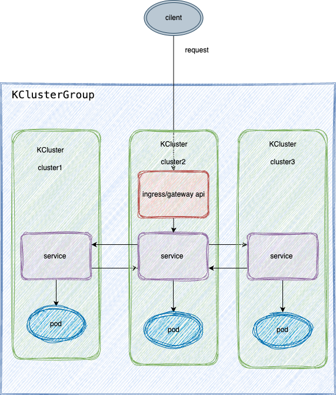

# Desgin
koffloader 是一个将多个集群网络进行连通的组件，将多个 cilium 集群或 submariner 集群的网络进行打通，并将按照需求将多集群内的 service 进行暴露，以达到应用跨多个集群的网络负载功能。 

koffloader 可以单独运行在多集群的管理集群上，也可以运行在组网集群中的一个子集群中。

# 架构

  

* koffloader crd 资源：
  * KCluster：集群信息配置，用于存放集群信息，管理多个集群。
  * ServiceExportPolicy：服务暴露策略，用于配置多集群内的 service 的暴露方式。
  * KClusterGroup：多集群组网配置，将多个 KCluster 集群组成一个网络。

# 功能
1. 多集群连通：将多个 cilium 集群或 submariner 集群进行组网。
   * cilium：
     * 用户需要将需要组网的集群部署好 cilium，然后将集群的信息配置到 KCluster 资源中。
     * 将需要组网 KCluster 资源，引用到 KClusterGroup 中，koffloader 通过 watch KClusterGroup，将各个集群组网，开启 clustermesh 功能。
   * submariner：
     * 用户需要将需要组网的集群部署好 submariner，然后将集群的信息配置到 KCluster 资源中。
     * 将需要组网 KCluster 资源，引用到 KClusterGroup 中，因在部署 submariner 时，多集群的网络已经组成，koffloader 不会再进行组网操作。

2. 多集群 service 暴露：将子集群的 service 暴露给其他子集群，供其他子集群访问，并带有负载功能。cilium 集群与 submariner 集群对于服务暴露的方式不同，因此，存在以下功能。
     * cilium: 
       * a. 可通过 global 开关，管理 service 是否被暴露给组网集群，该 service 可以在各个子集群中可以被访问。
       * a. 在开启 global 开关后，可通过 share 开关，管理 service 是否可以被其他子集群访问，此开关意义为当前集群可以访问其他子集群 service，但其他子集群不可以访问当前集群。
       * b. 可通过 servicer affinity 管理 service 负载优先级，分别为 remote 优先负载远端、local 优先负载本地、none 轮巡方式负载。
     * submariner：
       * a. 只有一种负载优先级，轮巡负载。

3. 多集群流量调度：当外部流量进入到集群 service 后，将各集群的南北向流量打通，并进行负载均衡。
   * 通过多集群 service 暴露将 service 进行负载，通过对 service 进行流量入口的配置，以达到多集群 service 的负载功能。
   * 此功能不由 koffloader 管理，koffloader 同步完 service，由用户自行创建 ingress 或 gateway api。
    

      
    
